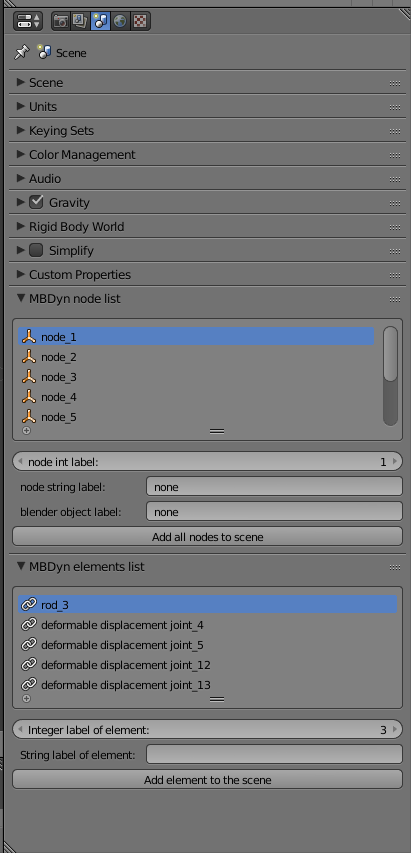
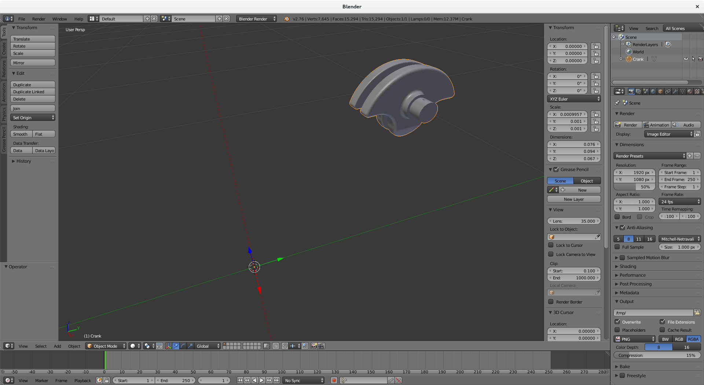
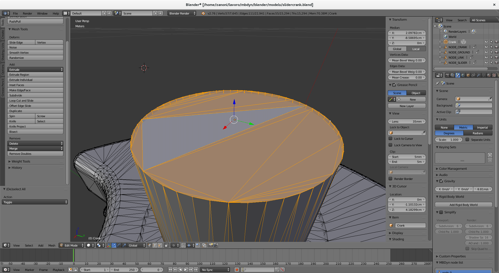
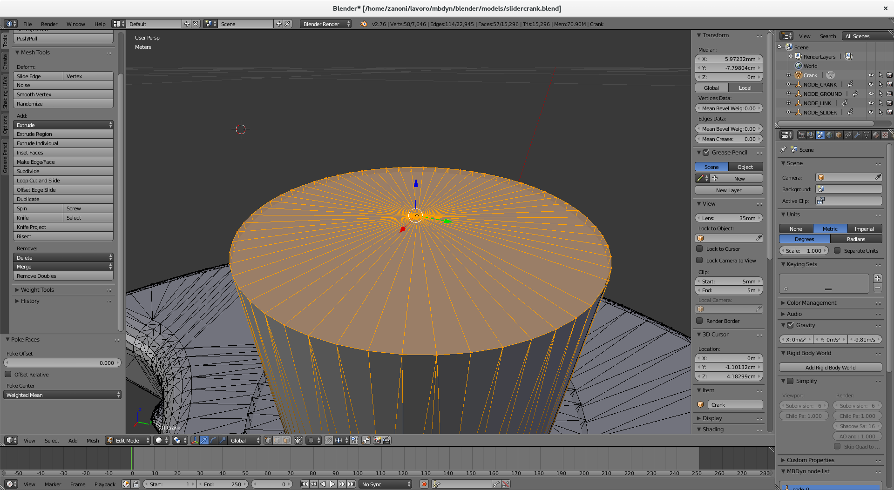
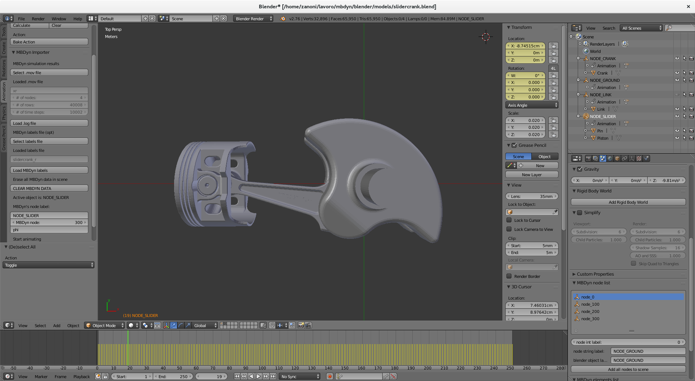
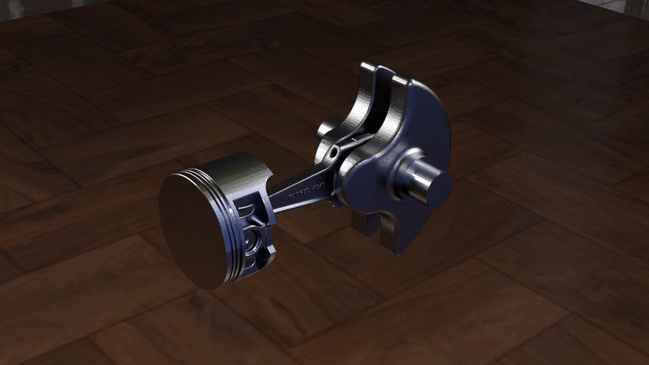

# mbdyn-blender
Animation Addon that imports the output of free multibody analysis code MBDyn:
see http://www.mbdyn.org/ and http://www.blender.org/ for more details.

# INSTALLATION
Download the complete repository with the "Download .zip" option and install in
Blender from File->User Preferences->Addons->Install from file...".

A very simple example can be found in the `test/` directory.

# BASIC USAGE
Once installed, the addon provides four additional panels in the Toolbar (in the
Animation tab) and Properties panels (in the Scene and Object tab)  of Blender.

Assuming that an [MBDyn][1] simulation has been performed
and that the output files have basename `test`, so that the standard output
would consist in the `test.mov`, `test.log`, `test.jnt` and `test.out` files,
the general procedure to import and visualize the model are described in the
following sections.

## Step 1: Select the simulation .mov file
From the left toolbar panel, located in the Animation tab of the 3D view area of
[Blender][6], click on the "Select .mov file" and locate the .mov file of the
simulation output. Please note that the `.mov` file *does not* necessarily contain
a valid simulation output: the initial structure of the model is loaded from the
`.log` file, which is always written, even in the case the initial assembly phase
of the simulation fails. The `.mov` file selection essentially serves to identify
the path and the basename of the [MBDyn][1] output files.

- - - 

- - - 

If the `.mov` file is located properly, some general info about its structure is
displayed after the "Loaded .mov file" label in the panel. Please notice that
until the `.log` file is loaded, the number of nodes and number of time steps in
the info panel will remain null.

## Step 2: Load the .log file
Once the basename and the path of the simulation output files has been set by
the selection of the `.mov` file, the `.log` file can be loaded by pressing the
"Load .log file" button in the panel. An message should appear in the
[Blender][6] toolbar at the top, informing the user that all the
[MBDyn][1] entities have been imported correctly. The number
of nodes and number of time steps is now displayed in the panel above the "Load
.log file" button.

## Step 3 [optional]: Load a labels file
The addon will, by default, assign a standard labeling to the imported
[MBDyn][1] entities, based on the integer labels found in
the `.log` file. If a different labeling is desired, a labels file can be
loaded. The labels file should contain [MBDyn][1] `set`
statements in the following (alternative) forms where the '[Nn]ode\_' part is
obligatory:

- - - 
	set: integer node_ground = 1;
	set: integer Node_ground = 1;
	set: integer NODE_ground = 1;
	set: const integer node_ground = 1;
	set: const integer Node_ground = 1;
	set: const integer NODE_ground = 1;
- - - 

In this case, the object associated to node 1 will be called node_ground,
(or Node_ground or NODE_ground) when it is added to the [Blender][6] scene.
In the same way, the labeling can be assigned to joints and beams. For example

- - - 
	set: integer joint_revolute = 1;
	set: const integer BEAM_cantilever = 5;
	set: integer JOINT_cardano = 1700;
	set: integer Beam_Link = 435;
- - - 

all generate valid labels. Please notice, though, that at the current state the
addon recognises only `rod` elements. The addition of support for other elements
is the first development priority as of now.
## Step 4: Add [MBDyn][1] nodes automatically or assign them to existing Blender objects
Once the `.log` file has been loaded, the addon populates two lists of
[MBDyn][1] objects in the Properties toolbar of Blender,
under the Scene tab.

- - - 

- - - 

The first list is made of the [MBDyn][1] nodes found in the
`.log` file of model. Selecting a node in the list will update the info shown at
the bottom of the list: the string label of the node is not "none" only if a
valid labels file has been selected and the label corresponding to the node has
been found. The button "Add all nodes to scene" triggers the spawning of an
'Empty' [Blender][6] object of type 'axes' for every node found in the list, in the
initial position and having the initial orientation of the node itself as found
in the `.log` file.

The second list contains the elements found in the `.log` file and recognised by
the addon. Please notice that *this is the most experimental part of the addon*,
and that *the majority of the elements are not supported as of now*. Only `rod`
joints are supported fully. The "Add element to the scene" button will spawn an
object (a straight line) representing the `rod` element. It will do nothing for
the other types of elements, as of now. 

If a [Blender][6] object is selected, another panel is drawn in the
Properties->Object sidebar. The Panel allows the user to directly assign an
[MBDyn][1] node to the currently selected [Blender][6] object by
pressing on the "ASSIGN" button, or to import it separately using the "ADD"
button. In the first case, the node will be associated with the [Blender][6] object,
using the [Blender][6] local Axes of the object as the reference frame: basically,
the node position and orientation will be assigned to the position and
orientation of the [Blender][6] Axes for that object. The user should put care into
moving the axes in the correct position with respect to the mesh to reproduce
the correct visualization. 

- - - 

- - - 

## Step 5: Animate the [Blender][6] scene
Once all the nodes and the elements of interest are loaded in the [Blender][6] scene,
pressing the "Animate scene" button in the Animation toolbar (left panel)
will trigger the addition of keyframes and the update of the position and
orientation of each [Blender][6] object that is associated with an
[MBDyn][1] node or
element, according to the simulation outputs contained in the loaded `.mov`
file. As an option, the user can select to animate the scene only once every *n*
timesteps, where *n* is an integer set with the "frequency" slider found after
the button.

## TUTORIAL 1. Rigid Crank Slider.
In this tutorial we will animate the slide-crank-piston models available at
[this link][2]. We're going to go through the model building and animation assuming
that we'd like to model the dynamic behavior of the real system, by following
these steps:
- start from a CAD model of the mechanical system;
- tune the [MBDyn][1] model to fit the mechanical system;
- run the multibody simulation;
- set up a [Blender][6] model to visualize the results in a simple way;
- enhance the [Blender][6] model by importing the CAD files as meshes;
- render the animation. 

## Step 1: The CAD model
We're going to use a publicly available CAD model of a slider-crank-piston
mechanical assembly as our reference. I'm using the very nice model by
**thinkin3D** available here: [engine starter kit][3].  If you want to follow
this tutorial exacly step-by-step you can register a free accunt at
[GrabCAD][4] and download it for free. I suggest using the
`.stp` version, but you can download the one that suits the CAD software you're
most comfortable with. 

If you open the .stp file in [FreeCAD][5], you can see
that the CAD assembly is made of 12 parts. We want to export the parts that
we'll like to animate in a mesh format that [Blender][6]
can import and measure some geometrical and inertial parameters of the model. 

---

---

To measure volumes and moments of inertia we'll make use of the macro
[FCinfo][7], developed by **Mario52**. 

Load [FCinfo][7] and click on the crankshaft part: you'll get a lot of
information about its geometry, that you can export to a text file with the
**Save** button. For example, you can see that the total volume of the
crankshaft is about 99842 mm3 and that its moment of inertia with
respect to the FreeCAD *x*-axis is about 54859396 mm5. The units of
the moment of inertia might confuse you, but remember that FreeCAD doesn't know
anything about the material the crankshaft is made of: therefore,
[FCinfo][7] outputs the moment of inertia divided by the density. We'll assume
that the crankshaft is made of SAE 4340 alloy steel (typically used for
crankshafts and rods). Its density is 7800 kg/m3. Thus we obtain a
moment of inertia Jxx of 427,9 · 10-6 kg m2,
and a mass of about 0.779 kg. The last piece of information that we need is the
crank *lenght*, i.e.  the distance between the rotation axis of the crankshaft
and the center of the hinge that connects it to the rod. You can also perform
this measurement in FreeCAD (or any other CAD software) and find it to be about
19 mm.

The last thing that we want to do with the crankshaft is to output its model to
a mesh format for the import in [Blender][6]. To do so, click on the Crankshaft part,
go to File->Export and choose Mesh format, calling the file (for example)
crank.stl. Using the `.stl` extension will tell FreeCAD to export the file in
the STL format, that [Blender][6] can understand.

Repeat the process for the rod (which is composed of the `combo002`, `combo003`,
`combo004` and `combo005` parts in the FreeCAD model), for the piston
(`combo001`), that we'll assume is made of forged aluminium, with 2700
kg/m3 density, and for the wristpin (`combo`). You should get the
following table of parameters: 

Part | Mass [kg] | Length [m] | Moment of Inertia [kg m2]
-----|-----------|------------|-------------------------------------
Crankshaft | 0.779 | 0.019 | 427.9 · 10-6
Rod | 0.065 | 0.076 | 34.7 · 10-6
Piston + Wristpin | 0.078 | - (immaterial) |- (immaterial)

[FCinfo][7] also reports the position of the center of mass of the part. We
thus learn that the COM of the crank is located, quite conveniently, 
approximately at the intersection between the rotation axis of the crankshaft
and its symmetry plane. The COM of the rod is located along the line connecting
its two hinges centers, at a distance of circa 52 mm from the piston hinge
center.

The piston's length and moment of inertia play no role in the multibody
simulation, since the piston does not rotate during its motion.

(To be perfectly honest, the mass of the crankshaft is immaterial for the
simulation results, too. You may want to apply it anyway, though, for example
to investigate the effects of a non-perfectly balanced crankshaft, simply by
offsetting the crank COM from the crankshaft rotation axis.... But i'm going off
to a tangent, here.)

Having now exported all the parts that we need we have a collection of 4 `.stl`
files. Mine looks like the following: 

- crank.stl
- rod.stl
- piston.stl
- wristpin.stl

It's time to simulate the [MBDyn][1] model and import the simulation results in
[Blender][6].

## Simulation and basic visualization
You can find the complete [MBDyn][1] model at [this link](FIXME). After running
the simulation and following the steps in the above sections, choosing to
automatically import all the nodes to the [Blender][6] scene, you should end up
with a scene similar to the one in the picture below, when viewed from the
positive *z*-axis:

---

---

The MBDyn simulation was run with a 10-3 s timestep for 10 seconds,
resulting in 10000 timesteps. We want to animate the results at 25 fps, so we
set 40 (1000/25) in the frequency parameter before importing the results with
the "Animate scene" button.

We now have a very simple animation of our model (that we could to debugg the 
[MBDyn][1] input file, for example). We'll use this collection
of Blender objects as the skeleton of our animated model. Our next step is now
to import the mesh files that we have previously converted in [FreeCAD][5].

## Importing the CAD model meshes

First of all, click on a new layer in the Blender scene: we'll keep the
*dressed* model completely separated by the *skeleton* model that we have
automatically imported.

Now go to File->Import->Stl (`.stl`) and select the crankhaft file. Notice that
[FreeCAD][5] uses millimiters as defaults units, while we used meters in [MBDyn][1]. 
The mesh model that we have just imported has thus to be scaled down by a factor 
0.001. You'll get something similar to the following picture:

---

---

You'll notice that the internal reference frame of the object used by blender
(the red, green and blue axes that appear when you select the object in Object
mode) is displaced quite a bit from the object mesh. We want this reference
frame (henceforth R.F.) to be coincident with the crank [MBDyn][1] node, that is
represented by the empty arrows object called `NODE_CRANK` in my scene.

First of all, let's place the internal Blender R.F. in a more convenient place
for us. Hit `Tab` to enter in edit mode and you'll notice that the mesh R.F. is
in the center of the mesh. Hit `Shift + S` and select "Cursor to Selected" to
move the 3D cursor of Blender in the center of the mesh R.F. Exit edit mode and
hit `Shift + Ctrl + Alt + C` and select "Origin to 3D Cursor". The object R.F.
center will be moved. Now you can set the location of the crank object to be (0,
0, 0) in the Transform panel, for convenience. 

We want the *z*-axis of the Blender R.F. to be aligned with the rotation axis of
the crankshaft, and its *x*-axis to point away from the counterweights. Rotate
the object by -90° about the *y*-axis and apply the rotation
with `Shift + A`. The mesh seems also slightly rotated about the *z*-axis, so I've
applied a forther rotation of -1.8° about *z*.

Now we want to place the R.F. origin in the correct place with respect to the
mesh. Remember that we placed the [MBDyn][1] node associated with the crank
midway between the crank axis and the crankpin center. 

The way I accomplished this is by though the followinf steps:

1. `Tab` into edit mode and select the faces on the outside edge of the crankshaft, as shown in the picture below

--- 

---

2. hit `X` and select "Faces" to delete the faces inside the circle
3. select the vertices on the circumference again
3. hit `F` to fill the circle with an n-gon
4. hit `Alt + P` to triangulate the n-gon with a central vertex.
5. select the central vertex, hit `Shift + S` and select "Cursor to Selected"
6. `Tab` to exit edit mode and hit `Ctrl + Shift + Alt + C` and then select
   "Origin to 3D Cursor"
7. set the location of the object to 0 in *x* and 0 in *y*. **Leave *z* as it
   is**.
8. set the cursor location to 9.5 mm in *x*, 0 in *y* and 0 in *z*
9. hit again "Ctrl + Shift + Alt + C" and select "Origin to 3D Cursor"

You should now have something similar to what is depicted below:

---

---
You can follow similar steps to place the Blender reference frames in the
correct positions with respect to the meshes. Now we want to assemble the meshes
and animate them.

## Assembling the meshes

Let's again start from the crank. Select the first layer, where the empties are
located, and select the `NODE_CRANK` empty object. Hit `Shift + S` and select
`Cursor to Selected`. Change layer and select the `crank` object. Hit again
`Shift + S` and this time select `Selection to Cursor`. Now the crank mesh is in
the correct position. Check the orientation of the `NODE_CRANK` empty: it says
0° about *x*, 0° about *y* and 180° about *z*. Apply the same rotation to the
`crank` object, and we're set. Check that the internal blender R.F. of the
`crank` and the `NODE_CRANK` empty are now aligned perfectly, by activating 
both the layers that we've worked on. 

Now deselect all by pressing `A`, select the `crank` object first and the
`NODE_CRANK` empty second (the order is important!) and then hit `Ctrl + P` and
choose `Set parent to object`. Now the movement of the `crank` object is tied to
the one of the `NODE_CRANK` object, that we already imported from [MBDyn][1]
results. If you play the animation, you should see the crank rotating about the
*z* axis. 

You can now repeat the process for the `rod` and `piston` objects. Notice that
you can parent the `wristpin` object to the `piston` object directly, since
there is not an [MBDyn][1] node associated with that component.

Your [Blender][6] scene should look like this, now

---

---

You can simply play back and forth the animation in Blender, or assign the
objects some materials and render the frames into a video file, like I did to
generate this .gif:

---

---

Happy simulations!

  [1]: http://www.mbdyn.org
  [2]: https://www.mbdyn.org/?Documentation___Official_Documentation___Examples
  [3]: https://grabcad.com/library/engine-starter-kit-1
  [4]: https://grabcad.com/
  [5]: http://www.freecadweb.org/
  [6]: https://www.blender.org/
  [7]: http://www.freecadweb.org/wiki/index.php?title=Macro_FCInfo
